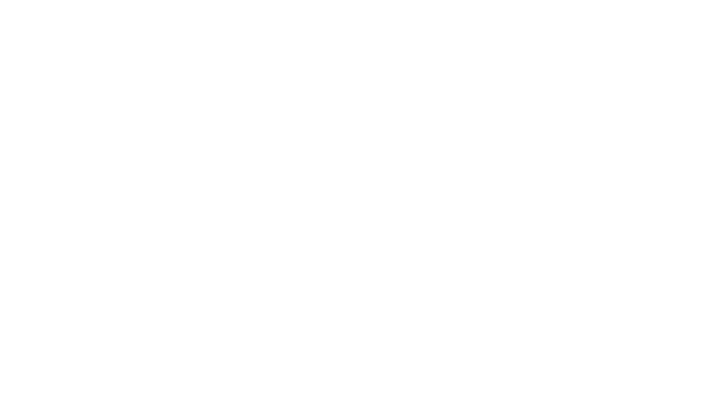

# 📸 Kiran Studio Portfolio

A modern, responsive photography portfolio website built using **HTML, CSS, and JavaScript**. This website showcases Kiran Studio's photography services, featured galleries, and contact information with an elegant and user-friendly interface.

## 🌐 Live Demo

🚀 **Website:**  
https://krishnasahu810.github.io/KIRAN-STUDIO-PORTFOLIO/

---

## 📷 Preview



---

## ✨ Features

- 📱 Fully Responsive Design
- 🎨 Modern & Clean UI
- 📸 Photography Portfolio Gallery
- 🎥 Embedded Video Section
- ⚡ Smooth Animations
- 🖼️ Image Showcase
- 📞 Contact Section
- 🌙 Attractive Layout
- 🚀 Fast Loading
- 💻 Cross-Browser Compatible

---

## 🛠️ Built With

- HTML5
- CSS3
- JavaScript

---

## 📂 Project Structure

```
KIRAN-STUDIO-PORTFOLIO
│
├── assets
│   └── img
│       ├── baby.jpg
│       ├── wedding.webp
│       ├── maternity.jpg
│       ├── logo.png
│       └── ...
│
├── index.html
├── style.css
├── app.js
└── README.md
```

---

## 🚀 Getting Started

### Clone the Repository

```bash
git clone https://github.com/Krishnasahu810/KIRAN-STUDIO-PORTFOLIO.git
```

### Navigate to the Project

```bash
cd KIRAN-STUDIO-PORTFOLIO
```

### Run the Website

Simply open:

```
index.html
```

in your browser.

---

## 🌍 Deployment

This project is hosted using **GitHub Pages**.

### Live Website

👉 https://krishnasahu810.github.io/KIRAN-STUDIO-PORTFOLIO/

---

## 📸 Gallery Includes

- Wedding Photography
- Pre-Wedding Shoots
- Couple Photography
- Baby Photography
- Maternity Photography
- Haldi Ceremony
- Custom Portraits

---

## 📈 Future Improvements

- Booking Form
- Admin Dashboard
- Image Filtering
- Dark Mode
- Testimonials
- Instagram Integration
- SEO Optimization

---

## 🤝 Contributing

Contributions are welcome!

1. Fork the repository
2. Create a feature branch

```bash
git checkout -b feature-name
```

3. Commit your changes

```bash
git commit -m "Added new feature"
```

4. Push the branch

```bash
git push origin feature-name
```

5. Open a Pull Request

---

## 👨‍💻 Author

**Krishna Sahu**

GitHub:
https://github.com/Krishnasahu810

---

## ⭐ Support

If you like this project, don't forget to ⭐ star the repository!

---

## 📄 License

This project is open-source and available under the **MIT License**.

---

## ❤️ Thank You

Thank you for visiting **Kiran Studio Portfolio**.

Have a great day! 🚀
